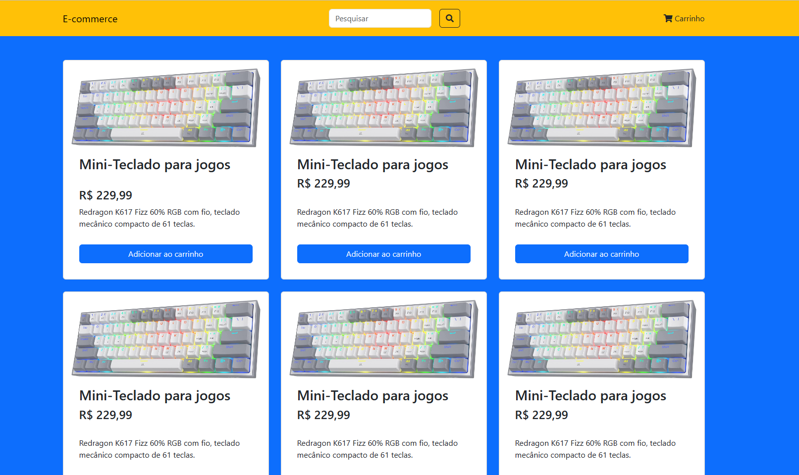

# 🛍️ Projeto E-commerce - Versão 1.0

## 💻 Sobre o projeto

Este é um sistema de e-commerce básico construído com PHP. O objetivo principal deste projeto é aprofundar os conhecimentos em programação orientada a objetos (OOP) e arquitetura MVC. Esta é a versão 1.0 do projeto, que se concentra em estabelecer as funcionalidades fundamentais de qualquer aplicação de e-commerce.

## 📚 Funcionalidades

- 🏷️ **Gerenciamento de Produtos**: Os usuários podem adicionar, editar e remover produtos. Cada produto possui propriedades distintas, incluindo nome, descrição, preço e imagem.

- 📋 **Visualização de Produtos**: Os usuários podem visualizar a lista de produtos disponíveis. Cada produto possui um botão ou link para uma página de detalhes, que mostra mais informações sobre o produto.

- 🛒 **Carrinho de Compras**: Os usuários podem adicionar produtos ao carrinho de compras, visualizar o carrinho, alterar a quantidade de itens e remover itens do carrinho.

## 🚧 Em Andamento

Este projeto está em constante desenvolvimento. A versão atual é apenas o começo. Conforme o conhecimento e as habilidades se expandem, planeja-se adicionar mais funcionalidades, como autenticação de usuário, checkout e pagamento, gerenciamento de pedidos e muito mais.

## 🎯 Como contribuir

Qualquer feedback, comentário ou sugestão é bem-vindo! Sinta-se à vontade para abrir uma issue ou enviar um pull request.

# 🎨🖌️ Fotos do projeto versão 1.0

  

## 💻 Como executar o projeto

1. Clone este repositório em sua máquina local.
2. Instale todas as dependências do projeto.
3. Configure o banco de dados conforme descrito no arquivo `config.php`.
4. Inicie o servidor e acesse o projeto em seu navegador.

## 🛠️ Tecnologias utilizadas

Este projeto foi construído usando as seguintes tecnologias:

## ✍️ Autor

João Félix - [LinkedIn](https://www.linkedin.com/in/joaofelixss)
