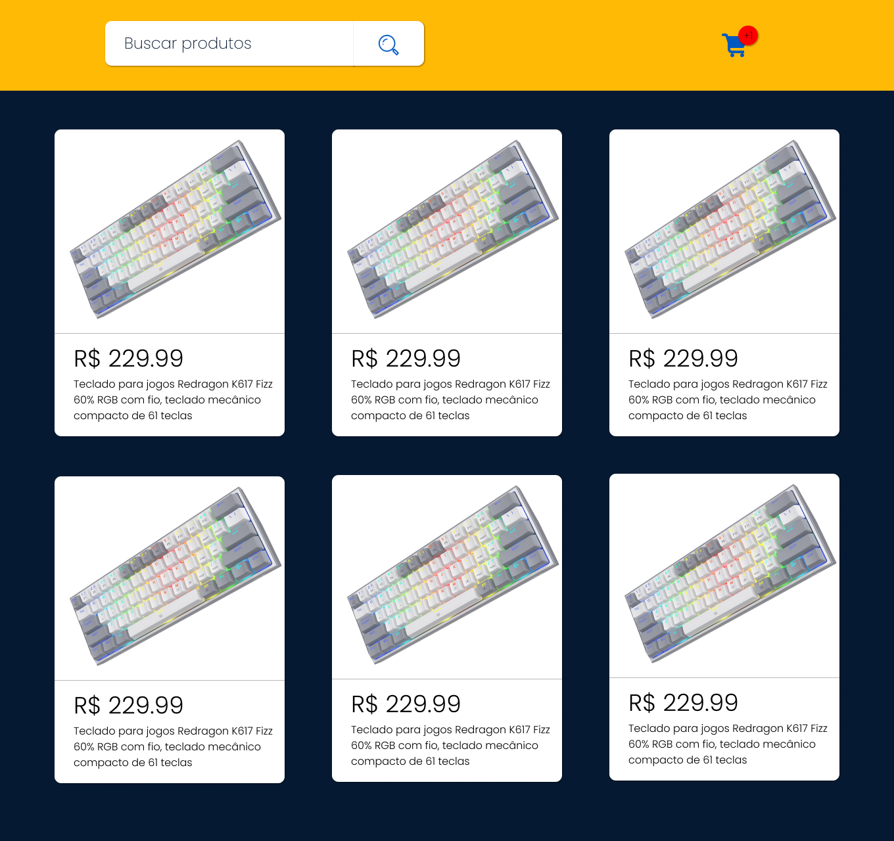

# 🛍️ Projeto E-commerce - Versão 1.0

Este projeto é um sistema de e-commerce básico construído com PHP. Estou desenvolvendo esse projeto para aprofundar meus conhecimentos em programação orientada a objetos (OOP) e arquitetura MVC.

O sistema de e-commerce irá incluir as seguintes funcionalidades na versão 1.0:

- 🏷️ **Gerenciamento de Produtos**: O sistema permitirá a adição, edição e remoção de produtos. Cada produto terá várias propriedades, como nome, descrição, preço e imagem.

- 📋 **Visualização de Produtos**: Os usuários poderão visualizar a lista de produtos disponíveis. Cada produto terá um botão ou link para detalhes do produto, que mostrará mais informações sobre o produto.

- 🛒 **Carrinho de Compras**: Os usuários poderão adicionar produtos a um carrinho de compras, visualizar o carrinho de compras, alterar a quantidade de itens no carrinho e remover itens do carrinho.

Este é um projeto em andamento e a versão 1.0 é apenas o início. Conforme meu conhecimento e habilidades crescem, planejo adicionar mais funcionalidades, como autenticação de usuário, checkout e pagamento, gerenciamento de pedidos, e muito mais. 

Acompanhe o progresso aqui no GitHub e sinta-se à vontade para deixar comentários, feedbacks ou sugestões!

# 🎨🖌️ Foto inicial do projeto no Figma

  

## 🚀 Tecnologias utilizadas

## ✍️ Autor
João Félix

https://www.linkedin.com/in/joaofelixss
